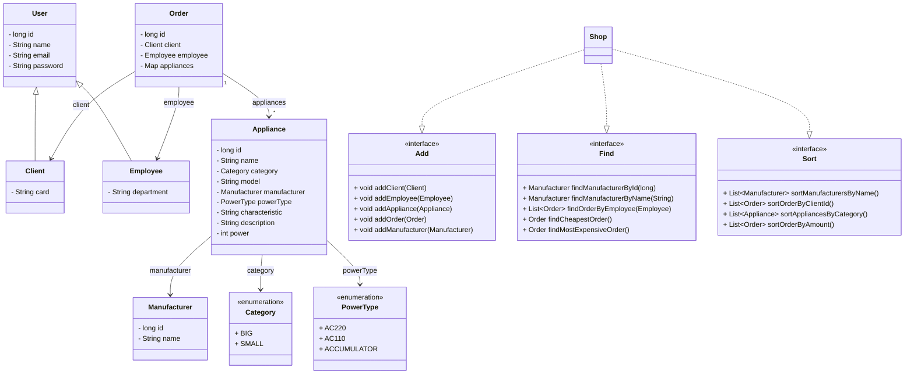

## Appliances Project

A small domain model of an appliance store. The project defines domain entities (models), enums, and service interfaces, plus a skeleton implementation `Shop`.

### Package structure
- `com.epam.rd.autocode.assessment.appliances.model`: domain models and enums
- `com.epam.rd.autocode.assessment.appliances.stream`: service-layer interfaces and the `Shop` class

### Classes and enums
- `User`: base user class (id, name, email, password)
- `Client` extends `User`: customer (card)
- `Employee` extends `User`: employee (department)
- `Manufacturer`: manufacturer (id, name)
- `Appliance`: product/device (id, name, category, model, manufacturer, powerType, characteristic, description, power)
- `Order`: order (id, client, employee, appliances as `Map<Appliance, BigDecimal>`)
- `Category` (enum): BIG, SMALL
- `PowerType` (enum): AC220, AC110, ACCUMULATOR

### Service-layer interfaces
- `Add`: addClient, addEmployee, addAppliance, addOrder, addManufacturer
- `Find`: findManufacturerById, findManufacturerByName, findOrderByEmployee, findCheapestOrder, findMostExpensiveOrder
- `Sort`: sortManufacturersByName, sortOrderByClientId, sortAppliancesByCategory, sortOrderByAmount
- `Shop` implements: `Add`, `Find`, `Sort`

### UML diagram (Mermaid)

### Source navigation
- Models: `src/main/java/com/epam/rd/autocode/assessment/appliances/model/*`
- Interfaces and `Shop`: `src/main/java/com/epam/rd/autocode/assessment/appliances/stream/*`
- Tests: `src/test/java/com/epam/rd/autocode/assessment/appliances/**/*`

### Notes
- The diagram reflects the actual fields and method signatures from the source code.
- A `Appliances.puml` file exists in the root, but the Mermaid diagram above is the source of truth for the current code state.
